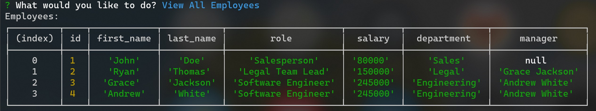

# SQL Challenge Employee Tracker

## Description

The SQL Challenge Employee Tracker is a command-line application that allows you to view and manage departments, roles, and employees in your company. With this application, you can organize and plan your business effectively. This application is built with MySQL, Inquirer, and console.table. The application is invoked with the following command: `npm start` or `node index.js`.

## Table of Contents

💠[Installation](#installation)
💠[Usage](#usage)
💠[Screenshots](#screenshots)
💠[License](#license)
💠[Contribution](#contribution)
💠[Test](#test)
💠[Credits](#credits)
💠[Questions](#questions)
💠[GitHub](#github)
💠[GitHub-link](#Github-link)

## Installation

1. Clone the repository: `git clone https://github.com/mackarimi/`
2. Navigate to the repo directory: `cd`
3. Open the repo in VSCode: `code .`
4. Open the integrated terminal from the VSCode: `ctrl+~`
5. Create a `.env` file in the root directory of the application. Add the following to it, replacing the values with your MySQL credentials (no quotes) once you have them:
   `DB_NAME='employee_tracker_db' DB_USER='root' DB_PW='your password'`
6. Install the necessary dependencies: `npm install`, `inquirer@8.2.4`, `mysql2`,`dotenv`
7. Navigate to the `index.js` file: type in `mysql -u root -p` then enter your password.
8. Start the application from index.js: Log into `npm start` or `node index.js`

## Usage

1. Start the application: `npm start` or `node index.js`
2. Select the option from the menu use arrow keys and enter.
3. What would you like to do? View all departments, View all roles, View all employees, Add a department, Add a role, Add an employee, Update an employee role, Update an employee manager, View employees by manager, Delete Data, View department budget, Exit.

## Screenshots

View demo video here:
https://www.loom.com/share/85a160d697cc4b61ac423c247b7320df?sid=172848fc-1dc9-4341-8175-0518af2e2bc0

## License

This project is licensed under the None license.

## Contribution

Please let me know how I can improve this project. Issues and pull requests are always welcome.

## Test

No test is included in this project.

## Credits

https://www.npmjs.com/package/mysql2
icon8.com for the icons.
stackoverflow.com for the help with the code.
https://codingartistweb.com/

## Questions

Questions or feedbacks are always welcome and appreciated.💬

## GitHub 💻

## GitHub Link:

